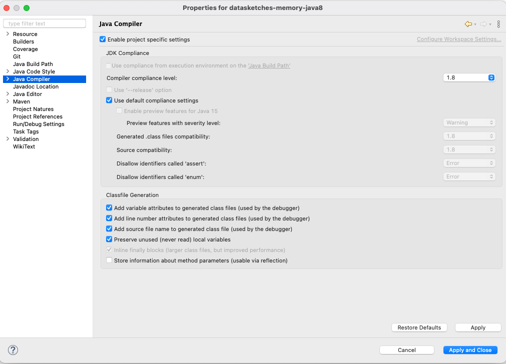
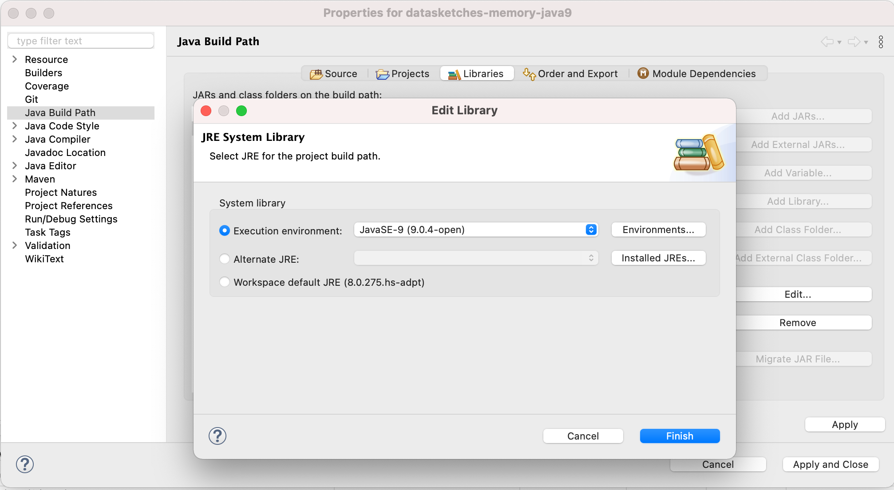
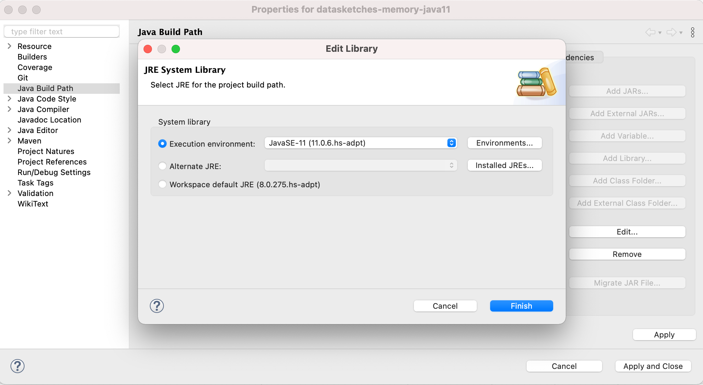

# Eclipse IDE setup

The use of Maven submodules to build a Multi Release JAR was motivated by its compatibility with popular IDEs.

There are two configuration properties to be aware of when configuring your local development environment:

#### Java compiler versions

Settings are usually synchronised with maven toolchain configuration, otherwise the Java version for a maven module
should be set as follows:

| Maven submodule                   | JDK |
| --------------------------------- | --- |
| datasketches-memory-root			|  8  |
| datasketches-memory			    |  8  |
| datasketches-memory-java8			|  8  |
| datasketches-memory-java8-tests	|  8  |
| datasketches-memory-java9		    |  9  |
| datasketches-memory-java9-tests	|  9  |
| datasketches-memory-java11		|  11 |

#### Compiler arguments for JPMS

In order to compile Maven modules in Java versions 9 and above, it is necessary to provide the following arguments to the
compiler.  These are usually synchronised with the `pom.xml` configuration:

```xml
    <compilerArgs>
        <arg>--add-exports</arg>
        <arg>java.base/jdk.internal.ref=org.apache.datasketches.memory</arg>
        <arg>--add-exports</arg>
        <arg>java.base/jdk.internal.misc=org.apache.datasketches.memory</arg>
    </compilerArgs>
```

---

## Eclipse configuration

Note that the following configuration was verified using Eclipse Version: 2020-12 (4.18.0)

#### The eclipse maven plugin

The [Eclipse Maven plugin](https://maven.apache.org/plugins/maven-eclipse-plugin/) is used to generate Eclipse IDE files.  In order to run the eclipse plugin use:

    $ mvn clean process-classes eclipse:eclipse -DskipTests=true

More information about using the eclipse plugin with multi-module Maven builds can be found [here](https://maven.apache.org/plugins/maven-eclipse-plugin/reactor.html).

Please note that this plugin is retired and no longer maintained!

#### Java compiler settings

You must ensure that project specific settings are used for the Java Compiler.  Open the `Java Compiler` dialog, and ensure `Enable project specific settings` is checked:



You might need to verify this for each module, making sure the correct compliance level is used:

- `datasketches-java9` should use level 9 compliance.
- `datasketches-java11` should use level 11 compliance.
- all other modules should use level 1.8 compliance.

#### JRE library versions

Ensure that the correct SDK is used for each module using the Eclipse `Java Build Path` dialog.

First, open the project properties dialog for the `datasketches-java9` project, and click on `Java Build Path`. Next, open the `Libraries` tab and select the `JRE System Library` under `Modulepath`.  Click `Edit` and select the Java 9 JRE:



Follow a similar process for `datasketches-java11`, but select the Java 11 JRE instead:



Lastly, for all other modules set the `JRE System Library` to the Java 8 JRE:


#### Compiler arguments for JPMS

Ensure that the required JPMS arguments are set for the compiler (Java 9 only). First, open the project properties dialog for the `datasketches-java9` project, and click on `Java Build Path`:


Next, open the `Module Dependencies` tab and add an export for `java.base/jdk.internal.ref`:


Add an additional export for `java.base/jdk.internal.misc`:


Finally, click `Apply and Close`:


Note: These arguments need only be supplied for `datasketches-java9`.